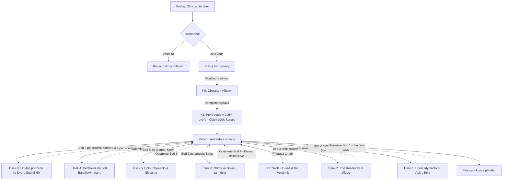

# Dobrodružství: Vodní cesta

Tento dokument slouží jako hlavní architektonický a narativní design dokument gamebookového dobrodružství **Vodní cesta** (`velky-vont-vodni-cesta`). Doplňuje obecný kánon světa v `world.md` a určuje pravidla, topologii, přístupové body, osu příběhu, uzlovou strukturu a herní mechaniky.

---

## 1. Premisa a hrdina

### Kdo je Jarek
- **Věk:** 14 let.
- **Původ a bydliště:** Narodil se a žije ve Stínadlech. V jeho ulici vyrůstá málo dětí, proto dochází do školy za Rozdělovací třídu do novější zástavby. Patří ke generaci, která zažila odchod starších Vontů a přerušení kontinuity vědění.
- **Dovednosti a limity:** Chodí na plavecké hodiny a umí plavat. Z plovárny však zná jen klidnou, teplou a osvětlenou vodu – ne temný, ledový, stísněný kanál s kluzkými kamennými stěnami a neznámým dnem.
- **Cíl hrdiny:** Nechce se stát Velkým Vontem ani spasit Stínadla. Má klukovskou touhu a posedlost **zmapovat věc, na kterou se zapomnělo** – zjistit, kudy voda pod městem teče, kde se větví a kam odtéká.
- **Zákaz a překážky:** Rodiče přísně zakazují přibližovat se ke kanálu („je to voda ve sklepě, ani se tam nedívej“). Otec navíc pracuje v Kotlech na směny. Porušení zákazu hrozí domácím vězením a zabavením sešitu s mapou. Tma, chlad, strach z výšek a stísněných prostor jsou reálné limity.

### Mantinely příběhu
- Žádná magie, nadpřirozeno ani fantastické stroje.
- Žádná digitální technologie, telefony ani moderní vybavení.
- Žádné zbraně, smrt ani nevratná zranění. Pád do vody znamená mokré šaty, prochladnutí, ohrožení výbavy a nutnost ústupu.
- Dospělí se nepřemáhají silou – využívá se jejich nepozornosti, vyjednává se s nimi, nebo se jim vyhýbá.

---

## 2. Topologie vodní cesty a přístupové body

Fyzická trasa kanálu je fixní městská tepna. Kanál je v celém profilu naplněn vodou a protéká velmi pomalu (hladina působí téměř stojatě, hučí pouze splav na dolním konci a komory zdymadel při napouštění).

Voda nestéká pouze jedním uzavřeným tunelem – střídají se klenuté úseky pod domy, otevřená koryta mezi štíty a podzemní síně. 

Zásadním designovým pravidlem je, že **každý dokončený úsek končí novým výstupem na povrch**. Jakmile Jarek úsek jednou zdolá, získá trvalý přístupový bod z ulice a pro další výpravy už nemusí zdlouhavě procházet dříve probádané podzemí.

```
                       [BÍLÉ DOMY / ŘEKA]
                               │
       ═══════════════════════════════════════════════════════════════
       (Bod 1) Vtok pod nábřežím u řeky (přístup z nábřeží)
            │  [Úsek 1: Vnější přívod a Horní zdymadlo]
       (Bod 2) Šachta u Rozdělovací třídy (přístup z hraničního pásma)
            │  [Úsek 2: Klenba pod hranicí čtvrtí]
       ═══════════════════════════════════════════════════════════════
                   [STÍNADLA - HLAVNÍ DĚJISTVÍ]
       ═══════════════════════════════════════════════════════════════
       (Bod 3) Cizí dvůr Novákových (výchozí bod – přístup přes plot)
            │  [Úsek 3: Obytné podzemí & Otevřená soutka bez říms]
       (Bod 4) Stará náplavka u Dvora Sedmi klik (žulové schody na dvůr)
            │  [Úsek 4: Cechovní síň & Soutok pod Barvířským náměstím]
       (Bod 5) Poklop u studny na Barvířském náměstíčku (kamenná šachta)
            │  [Úsek 5: Kanál do Kotlů & Dolní zdymadlo]
       (Bod 6) Dok Staré slévárny v Kotlech (uhelná rampa / uhelný sklep)
            │  [Úsek 6: Odtokový kanál ze Stínadel]
       ═══════════════════════════════════════════════════════════════
       (Bod 7) Výtokový splav (volný přístup z louky u potoka)
                               │
                       [HRANIČNÍ POTOK ──▶ ŘEKA MIMO MĚSTO]
```

### Seznam povrchových přístupových bodů

| Bod | Název bodu | Typ vstupu z povrchu | Odemčení v příběhu |
|---|---|---|---|
| **Bod 1** | **Vtok u řeky** | Sestup z nábřeží pod převislé vrby | Závěr pátrání proti proudu (K9). |
| **Bod 2** | **Šachta u Rozdělovací** | Servisní průlez u tramvajové trati | Po překonání Horního zdymadla (K8). |
| **Bod 3** | **Cizí dvůr Novákových** | Přelezení plotu vedle Jarkova domu | K dispozici od začátku hry (K1). |
| **Bod 4** | **Stará náplavka (Dvůr Sedmi klik)** | Dřevěná vrátka a žulové schody do vody | Po zdolání Úseku 3 (soutka bez říms). |
| **Bod 5** | **Barvířské náměstíčko** | Litinový poklop vedle vyschlé studny | Po vyřešení soutoku v Cechovní síni (Úsek 4). |
| **Bod 6** | **Stará slévárna v Kotlech** | Železný žebřík z uhelné rampy do zatopeného doku | Po zprovoznění Dolního zdymadla (Úsek 5). |
| **Bod 7** | **Výtokový splav** | Volně přístupná louka a břeh u hraničního potoka | Průzkum okraje města (K2) – uzavírá dolní směr. |

---

## 3. Herní smyčka: Večerní rozcestník a mapa

Hra se neodehrává v jednom nepřetržitém zátahu. Každá výprava představuje jeden odpolední či podvečerní průzkum.

1. **Výprava:** Hráč zvolí z rozcestníku známý **přístupový bod** a **směr** (po proudu / proti proudu).
2. **Výsledek výpravy:**
   - *Úspěch:* Překonání překážek daného úseku, nalezení a odemčení nového povrchového bodu, zakreslení úseku do mapy a bezpečný návrat ulicemi domů.
   - *Předčasný ústup:* Vyčerpání baterie, namočení výbavy, ztráta odvahy v úzkém prostoru nebo vyrušení dospělými. Jarek ustupuje zpět na známý výchozí bod. Den se nezapočte, ale neznamená konec hry – hráč to může zkusit znovu s jinou taktikou.
3. **Plánování u stolu:**
   - Jarek sedí v pokoji nad sešitem.
   - Každý nově odemčený povrchový bod dává možnost vstoupit přímo do něj, aniž by musel znovu procházet předchozí úseky.



---

## 4. Osa příběhu a detail úseků

### Fáze 0: Prolog a volba „Běžný chlapec“
- **Scéna:** Jarek sleduje z okna cizí dvůr Novákových. Voda se tiše leskne, hladina lehce stoupá a klesá. Rodiče odmítají jakékoliv otázky („voda ve sklepě, starý zákaz“).
- **Větev „Běžný chlapec“:** Hráč má hned na startu třikrát po sobě možnost říct si, že je to hloupost, nestojí to za malér a raději půjde do kina nebo zůstane u školních úkolů. Tři po sobě jdoucí volby vedou k bezpečnému zakončení *Běžný chlapec*.

### Fáze 1: Průnik do Cizího dvora bez výbavy (Poučení)
- Jarek v noci přeleze plot do Cizího dvora (Bod 3) k dřevěnému schodu u vody.
- Zkusí nahlédnout do klenutého ústí tunelu.
- **Okamžité vystřízlivění:** Voda je hluboká, kamenná římsa po dvou metrech končí, panuje absolutní černá tma, ze stropu kape a každé šplouchnutí dělá rámus. Bez světla, provazu a značkování hrozí pád, utopení svítilny a prozrazení.
- **Výsledek:** Jarek se dobrovolně vrací do pokoje. Pochopí, že do podzemí smí vstoupit až s kompletní výbavou.

### Fáze 2: K0 – Obstarání výbavy
Hráč musí zkompletovat 4 klíčové předměty z různých částí města přes lidi a malé protislužby:
1. **Lampa (malá černá svítilna):** Doma v šuplíku (je třeba drátkem opravit ulomený vypínač).
2. **Náhradní baterie:** U Lukáše ve škole za Rozdělovací třídou (výměna za slib a důvěru).
3. **Provaz:** V Provaznické (krátký úkol či vyjednávání s místní partou).
4. **Modrá křída:** V Kotlách (získání křídy odolné proti vlhku).

### Fáze 3: K1 – První výprava z Cizího dvora (Objev účelu kanálu)
- **Vstup a volitelná stopa na dvoře:**
  - Jarek přeleze plot Novákových (Bod 3) s kompletní výbavou.
  - V zadní kůlně se svítí a mluví tam dva dospělí.
  - **Volitelný krok (`k1-rozhovor`):** Jarek se může přikrčit za sudem na dešťovou vodu a vyslechnout rozhovor souseda Nováka s Vetešníkem z Lampářské ulice. Novák chce vyhodit staré železo vylovené ze dna kanálu, ale Vetešník ho přesvědčí, aby mu věci nechal: *„To jsou díly ze zdymadel, staré plavební řády... lidé zapomněli, jak se komory ovládaly, ale v mém krámu se to neztratí.“*
  - **Mechanický důsledek:** Pouze pokud hráč tento rozhovor vyslechne (nebo se o Vetešníkovi dozví později od Emy), odemkne se v rozcestníku volba pro návštěvu Vetešníka v Lampářské (`k4-1`). Bez této stopy Jarek o Vetešníkovi neví a volba se v rozcestníku nenabízí.
- **Sestup k vodě a objev:**
  - Jarek sestoupí k dřevěnému schodu u vody a rozsvítí svítilnu. Vytáhne klubko provazu z Provaznické a uváže ho k zábradlí schodu jako vodicí lano pro bezpečný krok na kluzkou římsu.
  - Všímá si pomalého posunu listí zprava doleva a vydává se **proti proudu**.
  - Zjišťuje, že nejde o splaškovou stoku, ale o stará technická díla:
    - Zrezavělé vyvazovací litinové kruhy pro lodní lana zapuštěné v pískovcových kvádrech.
    - Očazené a okované dřevěné odrazníky chránící stěny před nárazy lodních boků.
    - Kamennou desku s vytesaným znakem plavební správy (tři vlnovky) a nápisem *PLAVEBNÍ KANÁL MĚSTSKÝ*.
- **Závěr:** Jarkovi dochází pravda: **Tohle je starý plavební kanál!**
- Výprava proti proudu naráží na zřícené fošny a zával pod klenbou (ze shora duní tramvaj na Rozdělovací třídě). Jarek udělá modrou křídou svou první značku a dobrovolně se vrací do pokoje.
- **Založení mapy:** V pokoji vytahuje čistý sešit, zakresluje Bod 3 (Cizí dvůr) a úsek proti proudu (`grant: mapa`). Teprve nyní se poprvé otevírá **večerní rozcestník u mapy**.

---

### Fáze 4: Stínadelské úseky po proudu

#### Úsek 3: Od Cizího dvora ke Staré náplavce (Obytné podzemí & Soutka)
- **Vstup:** Bod 3 (Cizí dvůr Novákových, směr po proudu).
- **Trasa:** Kanál vede pod základy obytných domů. Z klenby vedou staré shozy na popel a světlíky; je slyšet běžný život nájemníků, vrzání pumpy na Ostružnickém dvoře a kroky na pavlačích. Pohyb musí být naprosto tichý.
- **Nález ztrouchnivělé pramice:** V klenutém bočním přístavním výklenku Jarek objeví uvázanou starou pramici s plochým dnem. Dřevo je zčernalé a ztrouchnivělé, na dně stojí kalná louže a leží tam odrazové dřevěné bidlo.
- **Překážka – Otevřená soutka bez říms:**
  - Kanál na několik desítek metrů vychází na denní světlo v úzké skalní/kamenné štěrbině mezi slepými štíty uličky Za Prádelnou.
  - Nahoře na ulici je jen rezavé zábradlí. Zde **zcela končí suchá římsa či patka** – stěny padají kolmo do černé hluboké vody.
  - **Volba překonání:**
    1. *Použití ztrouchnivělé pramice:* Jarek odvázat vrak lodi a odpichuje se bidlem. Obrovské napětí – dřevo sténá a praská, škvírami se tlačí voda, ale loď udrží jeho i sešit a svítilnu v suchu.
    2. *Traverz s provazem podél kramlí:* Šplhání podél kolmé stěny s využitím starých kovaných kramlí a zajištěním provazem. Fyzicky náročné na sílu paží a odvahu nad hloubkou.
  - *Neúspěch / pád:* Znamená okamžité promáčení, ledovou vodu a zoufalý boj o záchranu svítilny a mapy při doplavání ke schodům.
- **Cíl výpravy:** Nález šesti žulových schodů stoupajících z vody na **Starou náplavku (Bod 4)** u Dvora Sedmi klik.
- **Odemčení:** Jarek zevnitř uvolní závoru dřevěných vrátek a setká se s Emou „Špunt“. Ema mu ukáže tajnou západku vrátek a otevře mu bezpečný průchod do stínadelských ulic. V rozcestníku přibývá **Bod 4: Stará náplavka**.

#### Úsek 4: Ze Staré náplavky do Cechovní síně (Soutok pod Barvířským náměstím)
- **Vstup:** Bod 4 (Stará náplavka u Dvora Sedmi klik – žádné přelézání plotu u Novákových!).
- **Trasa:** Širší klenba historické části Stínadel.
- **Překážka – Cechovní síň a větvení ramen:**
  - Podzemní klenutá síň přímo pod Barvířským náměstíčkem, kde se sbíhá několik ramen (odpadní stoka, zazděný mlýnský náhon a hlavní plavební trasa).
  - **Hádanka sedimentů a proudění:** Jak poznat hlavní větev? Odpadní stoka nese černý kal a páchne; náhon je slepý a zanesený listím; hlavní kanál má na dně jemný křemičitý říční písek a plovoucí dřevěná tříska ukazuje pomalý tah vody.
  - V síni jsou staré cechovní značky barvířů a vybledlé křížové znamení Vontů.
- **Cíl výpravy:** Nalezení železných stupadel ve stěně vedoucích nahoru pod litinový **poklop u kašny/studny na Barvířském náměstíčku (Bod 5)**.
- **Odemčení:** Jarek uvolní zespodu západku poklopu a ověří si polohu na náměstíčku. V mapě přibývá **Bod 5: Barvířské náměstíčko**.

#### Úsek 5: Z Barvířského náměstíčka do Kotlů (Dolní zdymadlo & Stará slévárna)
- **Vstup:** Bod 5 (poklopem na Barvířském náměstíčku přímo do Cechovní síně a odtud po proudu).
- **Překážka – Dolní zdymadlo:**
  - Masivní dvouvrátá plavební komora, která odděluje historické Stínadla od průmyslových Kotlů.
  - Vrata drží obrovský tlak vody a nejdou otevřít silou.
  - **Technická hádanka:** Vyrovnání hladin (uzavření odtoku, otevření napouštěcího ventilu, vyrovnání hladin, uvolnění závory). Zde se uplatní návod a závěsníkova tyč získaná od Vetešníka v K4.
- **Prostředí za zdymadlem – Dok Staré slévárny v Kotlech:**
  - Zvuková kulisa: dunění bucharů a kovový hluk z horních provozů Kotlů, syčení páry, pach síry a koksu. Voda je vlažná.
  - Hrozí prozrazení dělníky (včetně Jarkova otce).
  - **Vedlejší linka:** Setkání s neznámým mužem v tmavém kabátě na rezavé lávce. Za pomoc s uvolněním vzpříčeného voru zodpoví právě jednu otázku ze stínadelského světa.
- **Cíl výpravy:** Železný žebřík vedoucí na starou uhelnou rampu a ven do uhelného dvora v Kotlech (Bod 6).
- **Odemčení:** V mapě přibývá **Bod 6: Stará slévárna v Kotlech**.

#### Úsek 6: Ze Slévárny ke Splavu (Konec kanálu za městem)
- **Vstup:** Bod 6 (uhelný dvůr slévárny v Kotlech).
- **Trasa:** Kanál opouští průmyslovou zástavbu, stěny přecházejí z cihel na volný kamenný zához, proud zrychluje a hučení sílí.
- **Cíl výpravy:** Kamenný přepad **Výtokového splavu (Bod 7)**, odkud voda padá do mělkého koryta hraničního potoka v polích.
- **Výsledek:** Jarek má definitivně ověřeno: *„Tady voda opouští město a ztrácí se v polích. Dolní konec je uzavřen a jasný. Všechno nevysvětlené leží nahoře proti proudu.“* Tato větev je kompletní a hráč se již nemusí dolním směrem zabývat.

---

### Fáze 5: Úseky proti proudu (Za Rozdělovací třídu k řece)

#### Podpůrné výpravy na povrchu:
- **K3 (Škola a Lukáš):** Zapojení Lukáše, zjištění informací o vnějším břehu řeky, stavbě přehrady a městském nábřeží.
- **K4 (Vetešník v Lampářské):** Získání plavebního řádu a informací o horních vratech výměnou za přenesení zásilky.

#### Úsek 2: Od Cizího dvora pod Rozdělovací třídu
- **Vstup:** Bod 3 (Cizí dvůr Novákových, směr proti proudu).
- **Trasa:** Odstranění zřícených fošen z K1. Dlouhý, rovný klenutý tunel přímo pod tramvajovou tratí Rozdělovací třídy. Pravidelné dunění tramvají nad hlavou otřásá klenbou.
- **Cíl výpravy:** Servisní šachta v hraničním pásmu Rozdělovací třídy (Bod 2).

#### Úsek 1: Od Rozdělovací třídy k Vtoku u řeky (Horní zdymadlo & Vpusť)
- **Vstup:** Bod 2 (šachta u Rozdělovací třídy).
- **Překážka – Horní zdymadlo:**
  - Samočinná protipovodňová tlaková vrata s plovákovým mechanismem.
  - Hádanka: vyčištění naneseného dříví a uvolnění protizávaží.
- **Cíl výpravy – Vtok u řeky (Bod 1):**
  - Průzkum vyústění u hlavní městské řeky. Vtok je z horní promenády zcela neviditelný – zakrývá ho mohutný žulový výběžek a převislé vrbové větve. Česle zadržují naplaveniny, ale voda jimi nerušeně proudí z řeky do podzemí.
- **Výsledek:** Poslední díl skládačky zapadl na své místo. Trasa je kompletní od vtoku po splav.

---

## 5. Návrh nelinearity a mechanických hádanek

### Taktické větvení uvnitř úseků
Aby kapitoly nebyly jen jednosměrným tunelem, klíčové uzly nabízejí volbu způsobu překonání terénu:
- **Suchá cesta (římsy, zdi, lávky):**
  - Vyžaduje provaz a překonání strachu z výšky (`vysoky`).
  - Je tichá – nehrozí probuzení nájemníků ani hluk vody.
- **Mokrá cesta (brodění, plavání):**
  - Fyzicky náročná, hrozí namočení a poškození mapy/zápisníku, vybití či ztráta svítilny.
  - Je hlučná (šplouchání se nese klenbou), ale nevyžaduje šplhání po římsách.
- **Slepé a boční komory:**
  - Možnost prozkoumat vedlejší zatopenou kobku (nález staré cechovní tabulky, nářadí nebo zápisu závěsníka) s bezpečným návratem na hlavní trasu.

### Mechanické hádanky (žádné náhodné hody)
1. **Vyrovnání tlaků (Dolní zdymadlo v Kotlech):** Hráč musí porozumět tomu, proč vrata nejdou otevřít (obrovský hydrostatický tlak vody) a jak funguje napouštěcí ventil k vyrovnání hladin v komoře.
2. **Plovákový mechanismus (Horní zdymadlo):** Odstranění naplaveného dřeva z obtokového kanálu, aby se komora vyprázdnila a závaží dovolilo zvednout závoru.
3. **Rozpoznání větví v Cechovní síni (Soutok):** Určení správné plavební větve podle typu sedimentů na dně (jemný říční křemičitý písek z řeky vs. černý městský splaškový kal) a sledování tahu plovoucí třísky.

---

## 6. Inventář a poznatky (15 položek)

| Klíč | Název | Typ | Účel a význam |
|---|---|---|---|
| `lampa` | Malá černá svítilna | Výbava | Nezbytný zdroj světla v podzemí. |
| `baterie` | Náhradní baterie | Výbava | Rezerva pro případ vybití; podmínka pro dlouhé výpravy. |
| `provaz` | Čtyři metry tenkého provazu | Výbava | Překonání srázů, zajištění na kluzkých římsách. |
| `kreda` | Modrá křída z Kotlů | Výbava | Značení křižovatek pro bezpečný návrat; drží i na vlhkém kameni. |
| `mapa` | Rozkreslená mapa | Poznatek | Jarkův rostoucí plán kanálu; hlavní ukazatel postupu. |
| `pruchody` | Utajené průchody | Poznatek | Znalost sklepních obchvatů a suchých spojek (od Emy). |
| `doklady` | Důkazy o trase | Předmět | Opis nápisu z kamene, vzorek říčního písku a nákres značek. |
| `denik-zavesnika` | Závěsníkův deník | Předmět | Staré záznamy manipulací se zdymadly a stavu vody. |
| `kredova-znacka` | Cizí modrá značka | Poznatek | Zjištění, že někdo tudy procházel už dříve. |
| `vetechnik-balicek` | Balíček od Vetešníka | Předmět | Závěsníkova tyč se závažím a lístek s pořadím kroků. |
| `vpust` | Vpusť u řeky | Poznatek | Potvrzení a zaměření začátku kanálu u řeky (Bod 1). |
| `splav` | Splav a hraniční potok | Poznatek | Potvrzení a zaměření konce kanálu za městem (Bod 7). |
| `vysoky` | Výhled shora | Zkušenost | Překonaný strach z výšek (podmínka pro lávky ve slévárně a na římsách). |
| `svědctvi-emy` | Emino svědectví | Spojenectví | Podpora stínadelské dívky před rodiči a domovníkem. |
| `svědctvi-lukase` | Lukášovo svědectví | Spojenectví | Podpora kluka z Bílých domů pro vnější svět a školu. |

---

## 7. Bilance a konce příběhu

V uzlu `bilance` Jarek skládá výsledky svého celého pátrání:

1. **Celá trasa (`konec-cela-trasa`):**
   - *Podmínka:* `mapa` + `vpust` + `splav` + návštěva horního i dolního zdymadla.
   - *Výsledek:* Kompletní, detailní mapa celé podzemní vodní cesty od řeky až po hraniční potok. Jarek dokázal to, na co všichni dospělí zapomněli.
2. **Mapa předaná po stínadelsku (`konec-ema`):**
   - *Podmínka:* `mapa` + `svědctvi-emy`.
   - *Výsledek:* Mapa zůstává tajemstvím Stínadel; Ema pomůže Jarkovi obhájit jeho výpravy před dospělými ve čtvrti.
3. **Mapa předaná přes Rozdělovací třídu (`konec-lukas`):**
   - *Podmínka:* `mapa` + `svědctvi-lukase`.
   - *Výsledek:* Lukáš vezme mapu k dospělým na radnici či říční správě; poznatek překračuje hranice Stínadel.
4. **Mapa podzemní vody (`konec-mapa`):**
   - *Podmínka:* `mapa` (nekompletní).
   - *Výsledek:* Cenné zachycení stínadelského úseku, i když začátek či konec zůstaly neobjevené.
5. **Částečný konec (`konec-castecny`):**
   - *Podmínka:* `doklady`.
   - *Výsledek:* Jarek má jen útržky a důkazy, ale ucelená trasa mu unikla.
6. **Běžný chlapec (`kino`):**
   - *Dosažení:* Volbou nezačínat hned v prologu.
   - *Výsledek:* Život bez podzemních tajemství, klid v rodině a běžné dospívání.
7. **Zákaz rodičů (`zakaz-konec`):**
   - *Dosažení:* Vědomé a opakované ignorování varování při přistižení dospělými.
   - *Výsledek:* Domácí vězení, zabavený sešit a definitivní konec výprav.

---

## 8. Struktura souborů a kapitol

Pro GamebookRuntime je dobrodružství rozděleno do číslovaných kapitol v adresáři `chapters/`, které jsou registrovány v hlavním manifestu `adventure.json`:

| Soubor | Počet uzlů | Obsah a herní význam |
|---|---|---|
| `chapters/01-uvod-a-cizi-dvur.json` | 29 | Prolog, Běžný chlapec, K0 Výbava (Kotly, Provaznická, škola), K1 Cizí dvůr & objev plavebního kanálu, Večerní rozcestník. |
| `chapters/02-splav-a-hranice.json` | 8 | Průzkum výtokového splavu na okraji města a hraničního potoka v polích (konec dolního toku). |
| `chapters/03-povrch-a-spojenci.json` | 12 | Povrchové linky: K3 Škola (Lukáš) a K4 Lampářská ulice (obchod a informace u Vetešníka). |
| `chapters/04-stinadla-podzemni-tok.json` | 29 | Stínadelské podzemí: Soutka bez říms, Stará náplavka u Dvora Sedmi klik (Ema), Barvířské náměstíčko, Cechovní síň. |
| `chapters/05-kotly-a-slevarna.json` | 37 | Průmyslový úsek: K5 Dolní zdymadlo (hádanka vyrovnání hladin), dok Staré slévárny v Kotlech, setkání s mužem v kabátě. |
| `chapters/06-horni-zdymadlo-a-vtok.json` | 18 | Úsek proti proudu: K8 Horní zdymadlo (protipovodňová tlaková vrata) a K9 Vtok u řeky (zapomenutá vpusť pod nábřežím). |
| `chapters/07-bilance-a-konce.json` | 6 | Závěrečný uzel `bilance` u stolu nad mapou a 5 finálních rozuzlení příběhu. |

